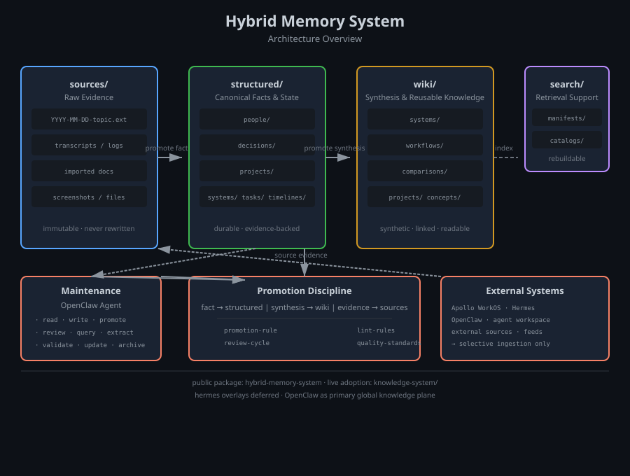

# Hybrid Memory System

A documentation-first hybrid memory architecture for long-running AI agents.

Most agent memory systems either keep too much chat history or depend too heavily on retrieval alone. Hybrid Memory System gives long-running agents a more durable knowledge model by separating evidence, facts, synthesis, and search into distinct layers.

The result is a memory system that is easier to maintain, easier to review, and more reliable to use across repeated real work.



## Architecture at a glance

```
sources/       →  Raw evidence (immutable)
structured/    →  Canonical facts & state
wiki/          →  Synthesis & reusable knowledge
search/        →  Retrieval support (rebuildable)
```

Each layer has a clear purpose and its own promotion discipline.

## Who this is for

- Personal AI assistants that need to remember facts reliably
- Research agents that compound knowledge over time
- Operational agents that handle recurring real-world work
- Long-running project assistants that need lower noise memory

## What is inside

- **Architecture docs** — layer design and reasoning
- **Schema packs** — structured records, wiki pages, promotion rules
- **Category schemas** — people, preferences, projects, decisions, systems, tasks, timelines
- **Templates** — copy-ready record and page templates for every category
- **Lint & quality standards** — rules to keep the system clean as it grows
- **Onboarding guides** — quick start, 30-minute guide, common mistakes
- **Public-safe examples** — minimal memory stack, category examples, lint findings

## Best starting path

1. Read this README
2. Read `PACKAGE-INDEX.md` for the full map
3. Read `QUICKSTART.md` to get started in minutes
4. Read `FIRST-30-MINUTES.md` for the full onboarding experience

## Core design principle

> Promote carefully. Not everything should become canonical memory. Only keep what will remain useful and trustworthy over time.

The system protects itself from becoming a noisy archive by enforcing clear boundaries between layers and a review discipline that catches degradation early.

## Architecture diagram


The diagram shows:
- **Four memory layers** from evidence to retrieval
- **Promotion discipline** connecting maintenance to canonical layers
- **External systems** (Apollo/Hermes, OpenClaw) feeding source evidence selectively
- **Boundary** between the public package and live knowledge-system adoption

## Quick reference

| Layer | Format | Purpose |
|---|---|---|
| `sources/` | Any raw file | Immutable evidence |
| `structured/` | YAML | Canonical facts, state, decisions |
| `wiki/` | Markdown + frontmatter | Reusable synthesis |
| `search/` | Manifests, catalogs | Retrieval support |

## Related resources

- `ARCHITECTURE.md` — detailed layer design
- `SCHEMA-PACK-V1.md` — structured record and wiki schema guidance
- `CATEGORY-SCHEMA-PACK-V1.1.md` — category-specific schema extensions
- `LINT-PACK-V1.md` — quality rules and maintenance workflow
- `QUICKSTART.md` — fastest path to a working system
- `repo/PUBLISHING-SEQUENCE.md` — how this package was released

## License

MIT — see `LICENSE`